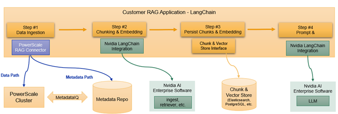

# PowerScale RAG Connector

The PowerScale RAG Connector is an open-source Python library designed to enhance RAG application performance during data ingestion by skipping files that have already been processed. It leverages PowerScale's unique MetadataIQ capability to identify changed files within the OneFS filesystem and publish this information in an easily consumable format via ElasticSearch.

Developers can integrate the PowerScale RAG Connector directly within a LangChain RAG application as a supported document loader, a LlamaIndex RAG application as a supported reader, or use it independently as a generic Python class.

## Workflow



*Figure 1: Workflow and integration of how the PowerScale RAG Connector integrates with the LangChain and NVIDIA AI Enterprise Software.*


## Audience

The intended audience for this document includes software developers, machine learning scientists, and AI developers who will utilize files from PowerScale in the development of a RAG application.

## Overview

This guide is divided into two sections: setting up the environment and using the connector. Note that system administration privileges are required for the initial configuration on PowerScale, which may need to be performed by PowerScale administrators.

## Terminology

| Term | Definition |
|------|------------|
| RAG | Retrieval Augmented Generation. A technique used to take an off the shelf large language model and provide the LLM context to data it has no knowledge of. |
| LangChain | LangChain is an open-source python and javascript framework used to help developers create RAG applications. |
| LlamaIndex | LlamaIndex is an open-source Python framework for building RAG applications. |
| Nvidia NIM Services | Part of Nvidia AI Enterprise, a set of microservices that can optional be used to efficiently chunk and embed files with GPU. The output of this data can be stored in a vector database for a RAG framework to use. |
| NV-Ingest | An Nvidia NIM microservice that will ingest complex office documents files with tables, and figures, and produce chunks and embedding to be stored in a vector database. |
| Chunking | The process of splitting the source file into smaller context aware pieces that can be searched and converted into vectors. Example: a chunk could be every paragraph within a large office document |
| Embedding | Turning a chunk of data into a vector where vector operations such as similarity, can be performed. |
| MetadataIQ | A new feature in PowerScale OneFS 9.10 that will periodically save filesystem metadata to an external database such as Elasticsearch |
| lin | Logical inode number. A unique and stable identifier for a file on PowerScale OneFS, used to track file versions across renames and modifications. |
| PowerScale RAG Connector | An open-source connector that integrates with LangChain or LlamaIndex to improve data ingestion when data resides on PowerScale. |

## Installation

### Basic installation
```bash
pip install powerscale-rag-connector
```

### Install with LangChain dependencies
```bash
pip install powerscale-rag-connector[langchain]
```

### Install with LlamaIndex dependencies
```bash
pip install powerscale-rag-connector[llamaindex]
```

### Full installation (LangChain + LlamaIndex)
```bash
pip install powerscale-rag-connector[all]
```

## Installing NVIDIA Ingest Client

The NvIngest examples use the v2 API. For more information refer to the [official NV-Ingest documentation](https://docs.nvidia.com/nemo/retriever/latest/extraction/nv-ingest-python-api/).

```bash
pip install nv-ingest-client
```


## Usage

The PowerScale RAG Connector can be used in three ways:

1. As a LangChain document loader
2. As a LlamaIndex reader
3. As a standalone Python class

### Using as a LangChain Document Loader

```python
from powerscale_rag_connector import PowerScaleDocumentLoader

loader = PowerScaleDocumentLoader(
    es_host_url="https://elasticsearch:9200",
    es_index_name="isi-metadataiq-index.cluster.guid",
    es_api_key="your-encoded-api-key",
    folder_path="/ifs/data"
)

for doc in loader.lazy_load():
    print(doc.metadata["source"], doc.metadata["change_types"])
```

Each returned `Document` includes `source`, `snapshot`, `lin`, and `change_types` in its metadata.

### Handling Modified Files

The `lin` field (logical inode number) is a stable file identifier on OneFS that persists across renames and modifications. Use it to remove stale chunks from your vectorstore before re-ingesting a modified file.

```python
for doc in loader.lazy_load():
    lin = doc.metadata["lin"]
    source = doc.metadata["source"]
    change_types = doc.metadata["change_types"]

    if "ENTRY_MODIFIED" in change_types:
        vectorstore.delete({"lin": lin})

    chunks = process_document(source)  # your chunking/embedding logic
    vectorstore.add(chunks, metadata={"lin": lin, "source": source})
```

### Using as a LlamaIndex Reader

Two LlamaIndex readers are available. **`PowerScaleSimpleDirectoryReader`** wraps LlamaIndex's `SimpleDirectoryReader` filtered to changed files:

```python
from powerscale_rag_connector import PowerScaleSimpleDirectoryReader

reader = PowerScaleSimpleDirectoryReader(
    es_host_url="https://elasticsearch:9200",
    es_index_name="isi-metadataiq-index.cluster.guid",
    es_api_key="your-encoded-api-key",
    input_dir="/ifs/data"
)

for doc in reader.lazy_load_data():
    print(doc.metadata["source"], doc.metadata["change_types"])
```

**`PowerScaleUnstructuredReader`** wraps LlamaIndex's `UnstructuredReader` for element-level parsing:

```python
from powerscale_rag_connector import PowerScaleUnstructuredReader

reader = PowerScaleUnstructuredReader(
    es_host_url="https://elasticsearch:9200",
    es_index_name="isi-metadataiq-index.cluster.guid",
    es_api_key="your-encoded-api-key",
    folder_path="/ifs/data",
    mode="elements"
)

documents = reader.load_data()
```

### Using as a Standalone Path Loader

```python
from powerscale_rag_connector import PowerScalePathLoader

# Initialize the loader
loader = PowerScalePathLoader(
    es_host_url="https://elasticsearch:9200",
    es_index_name="isi-metadataiq-index.cluster.guid",
    es_api_key="your-encoded-api-key",
    folder_path="/ifs/data"
)

# Get changed files
changed_files = loader.lazy_load()
```

## Examples

Check out the [examples directory](./examples) for complete usage examples:

- [Environment Configuration](./examples/.env.example)
- [PowerScale LangChain Document Loader](./examples/powerscale_langchain_doc_loader.py)
- [PowerScale LangChain Unstructured Loader](./examples/powerscale_langchain_unstructured_loader.py)
- [PowerScale LlamaIndex Simple Directory Reader](./examples/powerscale_llamaindex_simple_directory_reader.py)
- [PowerScale LlamaIndex Unstructured Reader](./examples/powerscale_llamaindex_unstructured_reader.py)
- [PowerScale Path Loader](./examples/powerscale_pathloader.py)
- [PowerScale NVIngest LangChain Document Loader](./examples/powerscale_nvingest_langchain_doc_loader.py)
- [PowerScale NVIngest LlamaIndex Simple Directory Reader](./examples/powerscale_nvingest_llamaindex_simple_dir_reader.py)
- [PowerScale NVIngest Path Loader](./examples/powerscale_nvingest_pathloader.py)

## Components

The connector consists of several modules:

- [PowerScalePathLoader](./src/powerscale_rag_connector/PowerScalePathLoader.py): Core module for identifying changed files
- [PowerScaleDocumentLoader](./src/powerscale_rag_connector/PowerScaleDocumentLoader.py): Custom DocumentLoader for LangChain integration
- [PowerScaleUnstructuredLoader](./src/powerscale_rag_connector/PowerScaleUnstructuredLoader.py): Custom Loader returning Documents processed by LangChain's UnstructuredLoader
- [PowerScaleSimpleDirectoryReader](./src/powerscale_rag_connector/PowerScaleSimpleDirectoryReader.py): Custom Simple Directory Reader for LlamaIndex integration
- [PowerScaleUnstructuredReader](./src/powerscale_rag_connector/PowerScaleUnstructuredReader.py): Custom Loader returning Documents processed by LlamaIndex's UnstructuredReader


## Requirements

- Python 3.10+
- Elasticsearch client
- PowerScale OneFS 9.10+ with MetadataIQ configured
- LangChain (optional, for LangChain integration)
- LlamaIndex (optional, for LlamaIndex integration)

## License

[MIT](https://github.com/dell/powerscale-rag-connector/blob/main/LICENSE)
